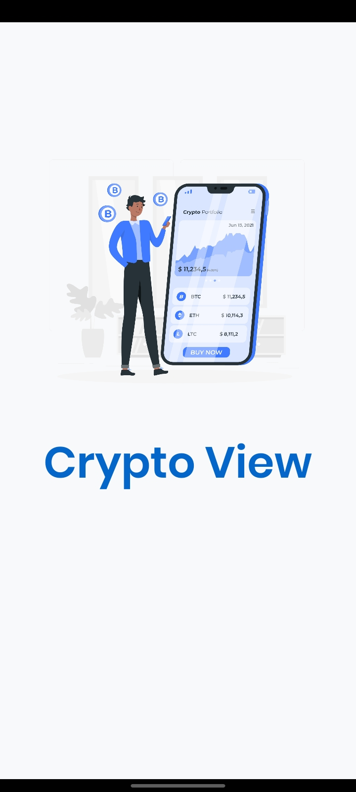
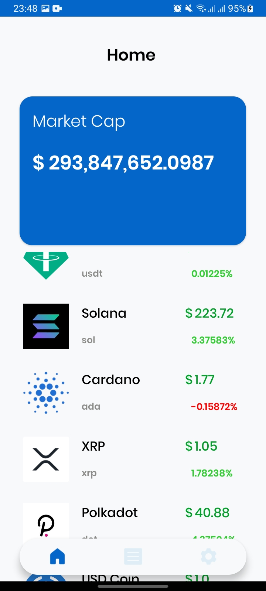
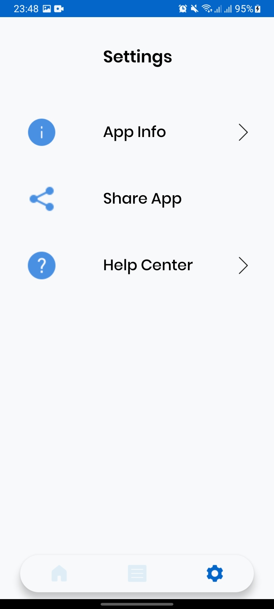
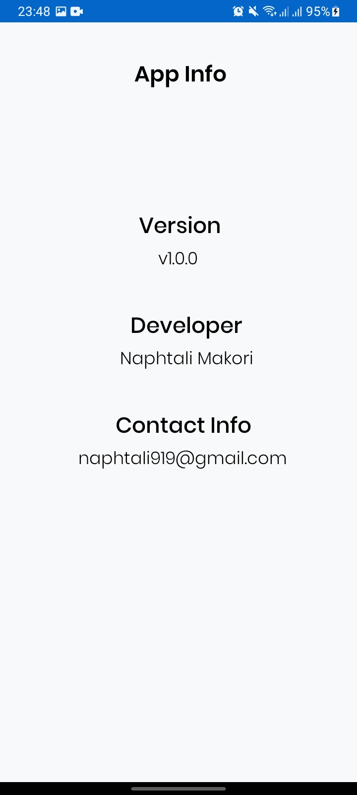

# Tracee App
## Author
Naphtali Makori
## App under construction!!!
## Description

This is an application that allows users to search for places to go have fun, take a walk or anything that satisfies them since it is hard to find places or trails to go to and be satisfied.

## Demo

          

        

## Installation Guide
* Ensure Git is installed.
* Clone the repo link or download the ZIP.
* Open terminal clone the project to any directory on the machine.
* Enter android studio and make sure gradle finishes to build.
* Run the application on the emulator/USB.

## Contributors
So far there are no contributors for this project.
If you wish to, contact me :)

## Contact Information
* Email- naphtali919@gmail.com
* Mobile Number- +254727991993
* Instagram @ _naphtalimakori
* Facebook @ Naphtali McOrri
* Linked In @ Naphtali Makori

## License
Licenced by

MIT License

Copyright (c) [2021] [Naphtali Makori]

Permission is hereby granted, free of charge, to any person obtaining a copy of this software and associated documentation files (the "Software"), to deal in the Software without restriction, including without limitation the rights to use, copy, modify, merge, publish, distribute, sublicense, and/or sell copies of the Software, and to permit persons to whom the Software is furnished to do so, subject to the following conditions:

The above copyright notice and this permission notice shall be included in all copies or substantial portions of the Software.

THE SOFTWARE IS PROVIDED "AS IS", WITHOUT WARRANTY OF ANY KIND, EXPRESS OR IMPLIED, INCLUDING BUT NOT LIMITED TO THE WARRANTIES OF MERCHANTABILITY, FITNESS FOR A PARTICULAR PURPOSE AND NONINFRINGEMENT. IN NO EVENT SHALL THE AUTHORS OR COPYRIGHT HOLDERS BE LIABLE FOR ANY CLAIM, DAMAGES OR OTHER LIABILITY, WHETHER IN AN ACTION OF CONTRACT, TORT OR OTHERWISE, ARISING FROM, OUT OF OR IN CONNECTION WITH THE SOFTWARE OR THE USE OR OTHER DEALINGS IN THE SOFTWARE.
